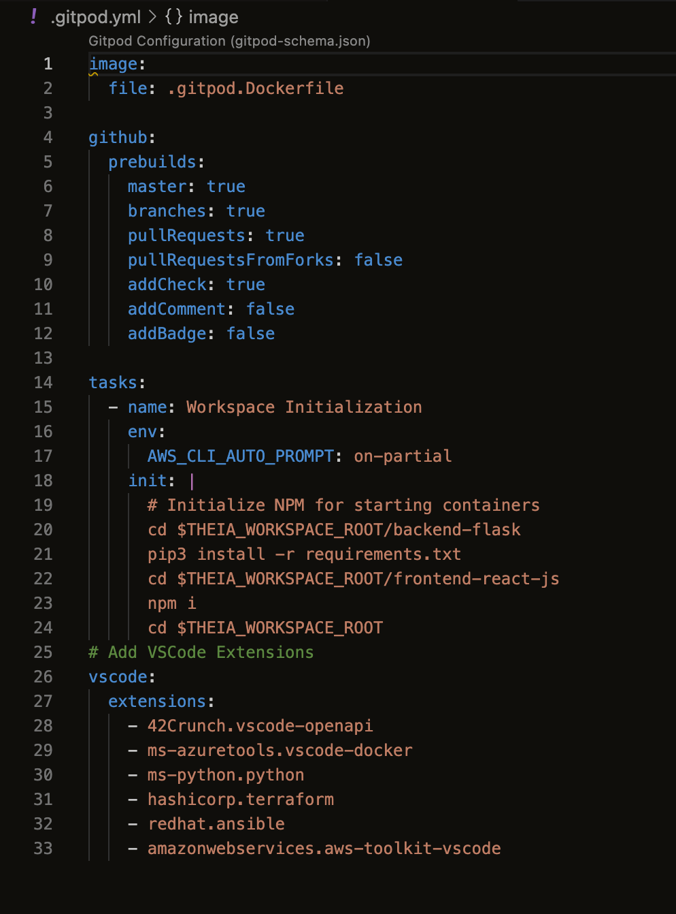
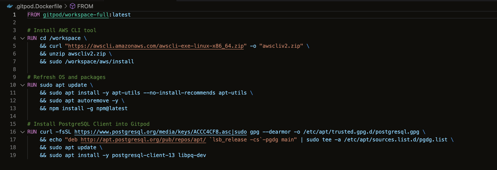
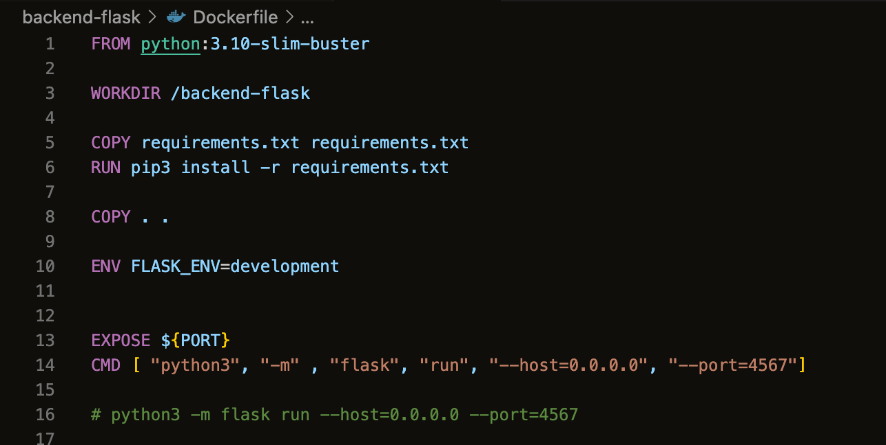
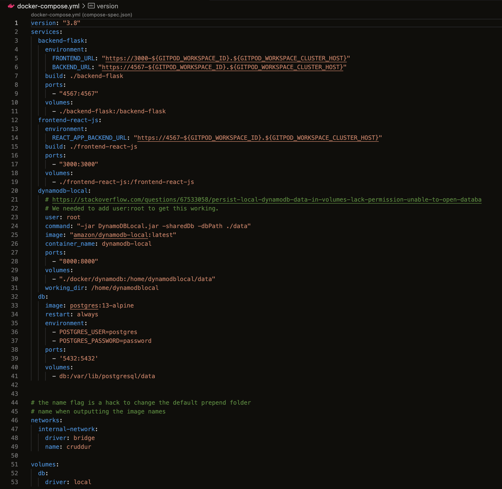
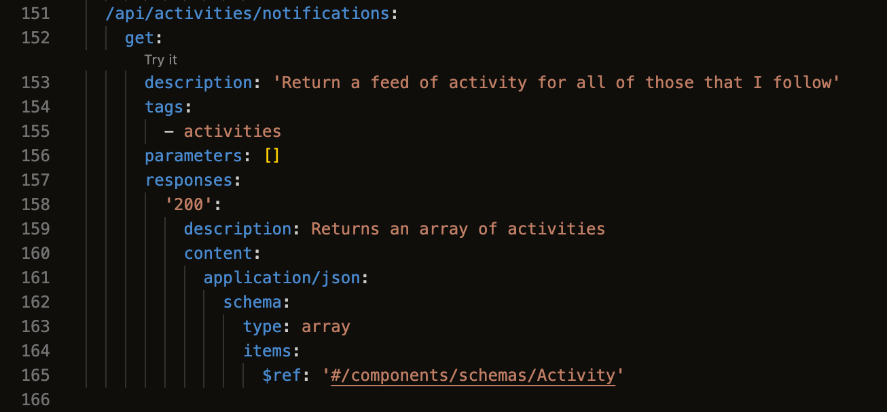
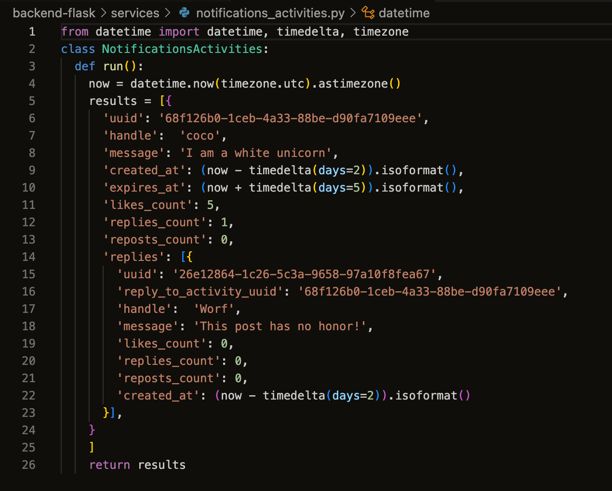
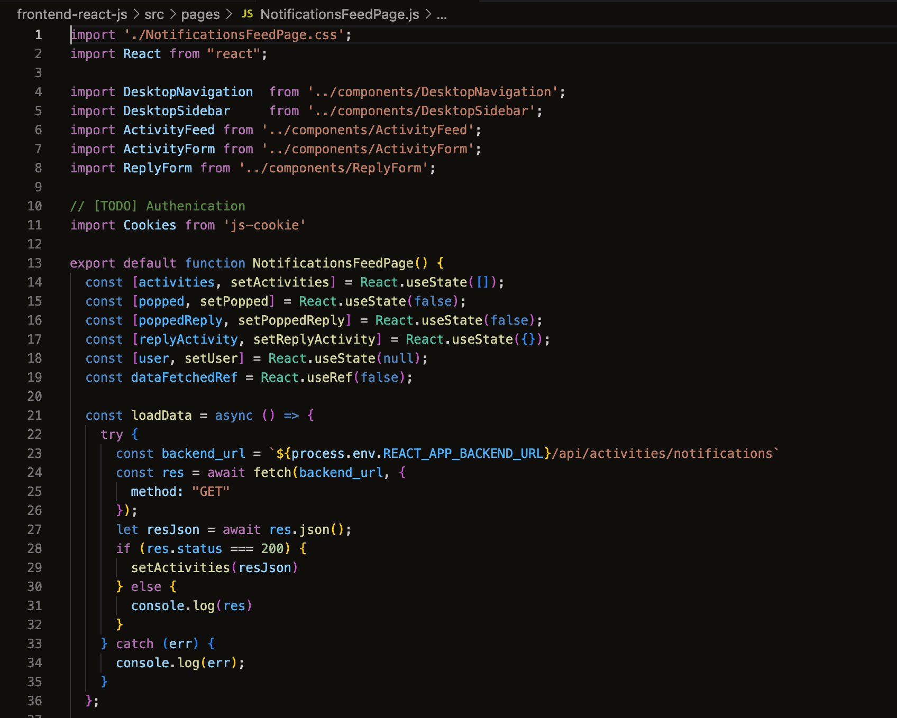
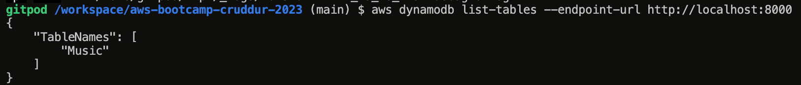
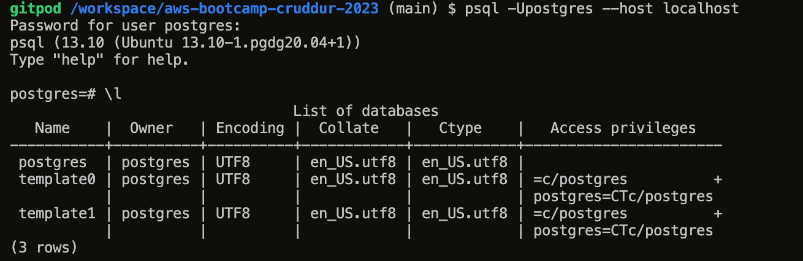

# Week 1 — App Containerization

## Required Homework/Tasks

### Watched the video playlist:
- Watch How to Ask for Technical Help
- Watched Grading Homework Summaries
- Watched Week 1 - Live Streamed Video
- Remember to Commit Your Code
- Watcked Chirag's Week 1 - Spending Considerations
- Watched Ashish's Week 1 - Container Security Considerations
- Containerize Application (Dockerfiles, Docker Compose)
- Document the Notification Endpoint for the OpenAI Document
- Write a Flask Backend Endpoint for Notifications
- Write a React Page for Notifications
- Run DynamoDB Local Container and ensure it works
- Run Postgres Container and ensure it works

### gitpod.yml & .gitpod.Dockerfile

Updated the install process within the two files to ensure that on launch everything will get installed correctly such as AWS CLI, PostgresSQL as well as installing updates & packages.

### Dockerfiles, Docker Compose

Created a Dockerfile for the backend-flask in the /backend-flask directory which installs the requirements.txt dependencies to create a backend with the port 4567.

Created a Docker compose file which includes the backend, frontend, dynamodb, postgres images, ports and volumes

### Notification Endpoint for the OpenAPI

Added Notifications activities to the openAPI which returns an array of activities

### Flask Backend Endpoint for Notifications

Created a Notifications Activities python file that is hardcoded with information that will display in the Cruddur Notifications tab

### React Page for Notifications

Created a Notifications Feed Page in JavaSctipt React that connects to the backend flask for the notifications activites and display the frontend of the application.

### Run DynamoDB Local Container and ensure it works

Tested the connection to Dynamodb with the `aws dynamodb list-tables --endpoint-url http://localhost:8000` command to ensure the connection was made.

### Run Postgres Container and ensure it works

Tested the connection to PostgresSQL with the `psql -Upostgres --host localhost` command to ensure the connection was made. Added the install process to the .gitpod.Dockerfile

